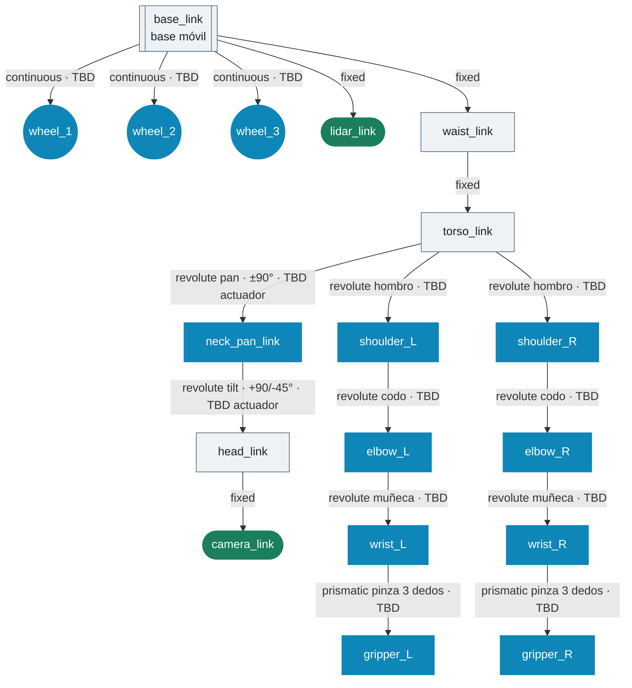

# Árbol cinemático (planificación)

Este diagrama **no es el URDF final** — es la jerarquía de enlaces y
articulaciones que se espera montar en Fusion en la fase 3 y exportar con el
plugin URDF Exporter. Los tipos de joint son los previstos; los ángulos límite
y el actuador de cada uno quedan como `TBD` hasta cerrar la fase 2
([`ROADMAP.md`](ROADMAP.md), milestone v0.2).

Las clases de color (`estructura`/`actuador`/`sensor`) y el estándar de
visualización técnica del proyecto (visores 3D, láminas Bento Grid, vistas
ortogonales normalizadas) los fijan las skills
[`toreto-cad-visual-identity`](../.claude/skills/toreto-cad-visual-identity/SKILL.md)
y [`toreto-mechanical-tokens`](../.claude/skills/toreto-mechanical-tokens/SKILL.md)
— no son arbitrarios, para que cualquier pieza nueva del proyecto use la misma
clave visual sin tener que redecidirla cada vez.

Sirve para razonar la estructura ahora, sin bloquear nada de CAD ni de
componentes — y como referencia directa cuando llegue el momento de nombrar
los links y joints reales en Fusion, para que coincidan con este árbol.

## Notas

- La base no es una cadena serie clásica: al ser holonómica de 3 ruedas omni,
  el `base_link` es el marco flotante de todo el árbol, no un eslabón fijo al
  suelo. Las 3 ruedas son `continuous` porque giran sin límite.
- `TBD` en cualquier joint significa: sin servo/motor elegido todavía. No
  fijar el ángulo límite hasta tener la hoja de datos del actuador real —
  poner un número ahora sería inventarlo.
- Cuando exista URDF real (fase 3), [`URDF-Visualizer`](https://github.com/UNLINEARITY/URDF-Visualizer)
  (WebGL/Three.js) es candidato para un visor interactivo del robot en el
  navegador — anotado en `ROADMAP.md`, no construido todavía porque no hay
  URDF que visualizar.
